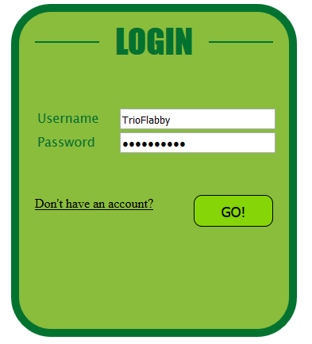
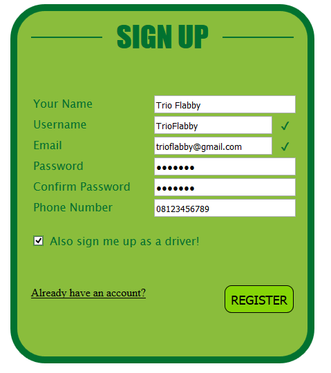
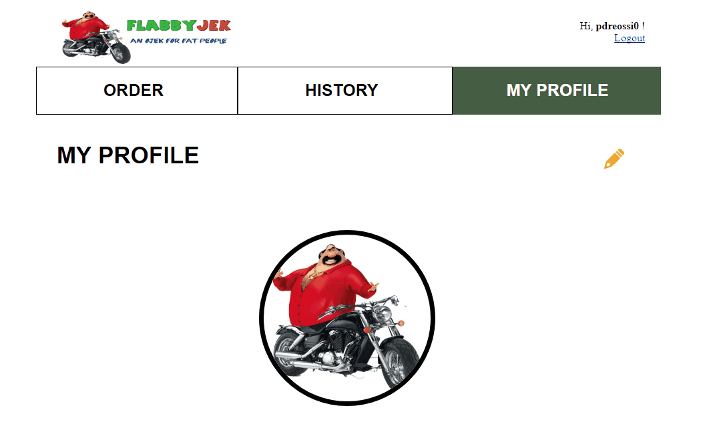
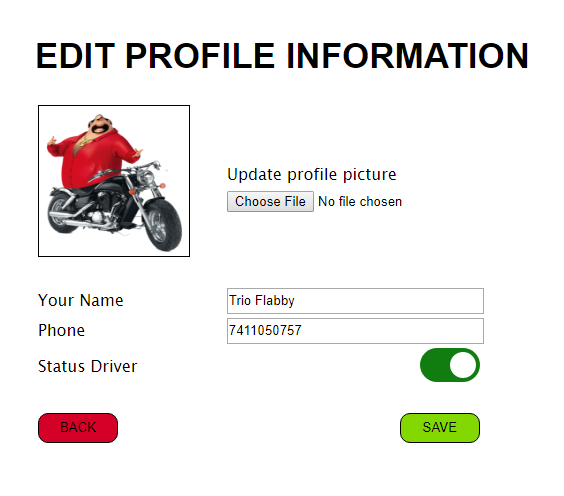
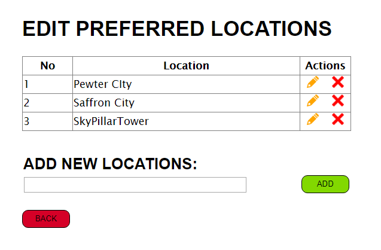
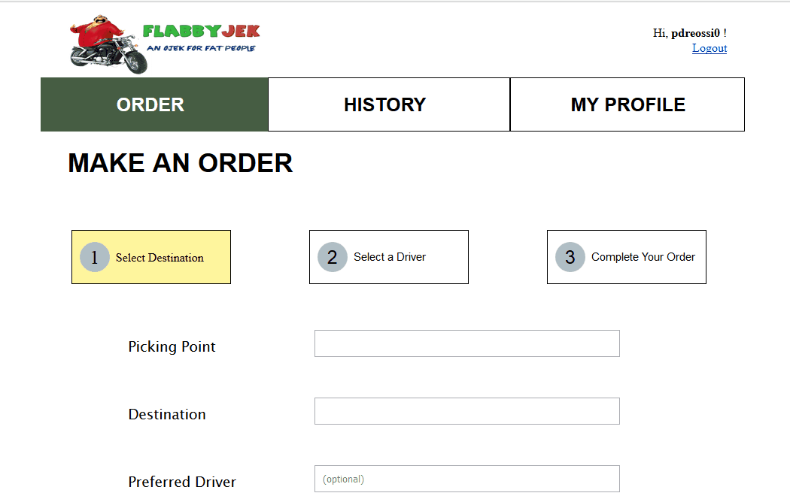
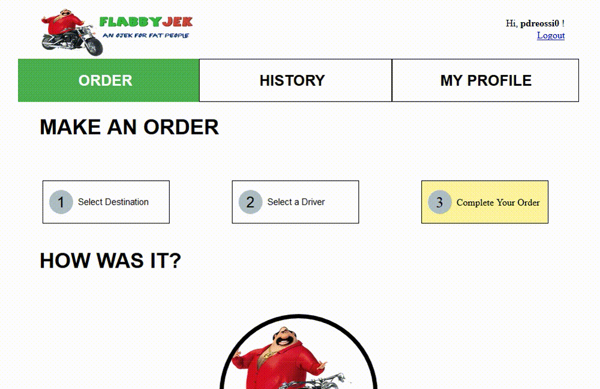
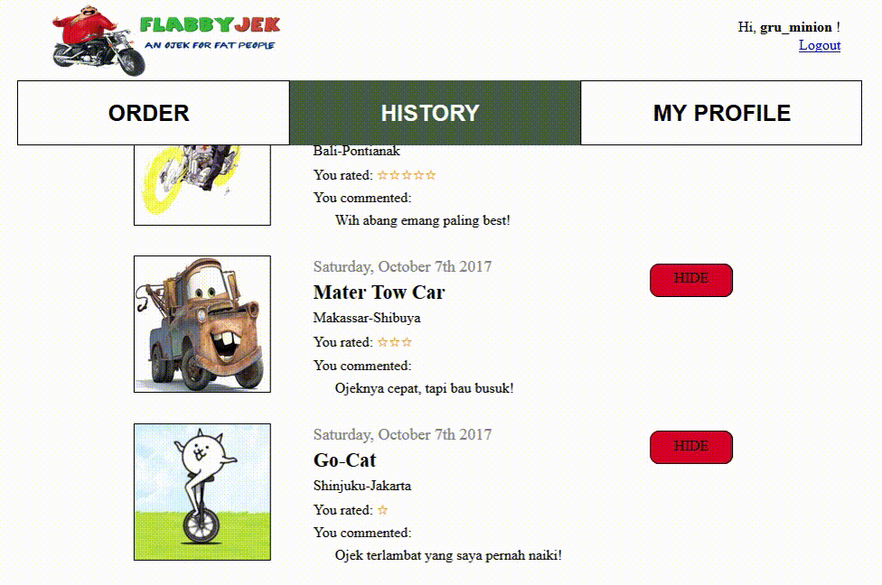
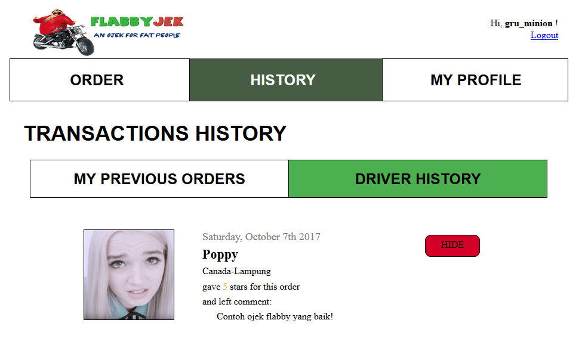

# Tugas 1 IF3110 Pengembangan Aplikasi Berbasis Web

Membuat sebuah **Website Ojek Online**

## Deskripsi Singkat

Pada tugas besar ini, kami diminta untuk membuat aplikasi *ojek online* **berbasis web** yang memungkinkan seorang pengguna untuk menjadi penumpang dan/atau *driver ojek online*. Untuk menggunakan aplikasi ini, seorang pengguna harus melakukan *login*. Pengguna dapat menjadi penumpang maupun *driver* pada akun yang sama. Untuk menjadi *driver*, pengguna harus mengaktifkan opsi menjadi *driver* pada profilnya.

Kami diminta untuk membuat tampilan sedemikian hingga mirip dengan tampilan pada contoh. *Website* yang diminta tidak *responsive*. Desain tampilan tidak perlu dibuat indah. *Icon* dan jenis *font* tidak harus sama dengan contoh. Warna *font*, garis pemisah, dan perbedaan ukuran *font* harus terlihat sesuai contoh. Format *rating* dan waktu harus terlihat sesuai contoh.

## Anggota Tim

Kelompok TrioFlabby terdiri dari tiga mahasiswa *flabby* yang diurutkan berdasarkan *the flabbiest tummy* yaitu:
1. Erick Wijaya - 13515057
2. Kezia Suhendra - 13515063
3. Catherine Almira - 13515111

## Penjelasan Singkat

### Login

Pengguna dapat melakukan *login* sebagai *user*. *Login* hanya membandingkan *username* dan *password* saja. Halaman ini merupakan halaman pertama yang dibuka oleh pengguna ketika menjalankan aplikasi. Ketika pengguna hanya mengisi *field username* atau *password* atau bahkan keduanya,  ketika ditekan tombol GO! maka akan muncul peringatan bahwa *field* tersebut harus diisi dan *form* tidak bisa di *submit* sebelum kedua *field* diisi. Ketika kedua *field* sudah terisi dan tombol GO! sudah ditekan maka pengguna akan masuk ke halaman *order*. Jika pengguna belum memiliki akun, pengguna dapat melakukan registrasi akun dengan menekan tulisan *Don't have an account?* yang akan membuat pengguna masuk ke halaman registrasi.

### Register

Pada halaman ini pengguna dapat mendaftarkan diri sebagai *user* agar dapat menggunakan aplikasi ini. Satu *user* akan memiliki satu akun yang dapat digunakan sebagai penumpang maupun sebagai *driver*. *User* disediakan opsi untuk memilih apakah dia mau menjadi *driver* atau tidak saat registrasi. Pengguna tidak dapat menggunakan *username* maupun *email* yang sudah dipakai oleh orang lain. Jika pengguna memasukkan *username* atau *email* yang sudah terdaftar pada aplikasi sebelumnya maka akan ditampilkan tanda silang dan pengguna tidak dapat melakukan registrasi sebelum memasukkan *username* atau *email* yang *valid* yang akan ditandai dengan tanda centang. Untuk melakukan registrasi, pengguna diharuskan untuk mengisi setiap *field* yang ada, jika ada *field* yang masih kosong maka pengguna belum bisa melakukan registrasi. Jika pengguna tidak memilih opsi untuk menjadi *driver*, pengguna otomatis masuk ke halaman *order* dengan keadaan sudah *login*. Jika pengguna memilih opsi menjadi *driver*, pengguna otomatis masuk ke halaman *profile* dengan keadaan sudah *login*.

### Profile

Pada halaman ini, ditampilkan *username*, nama lengkap, *email*, dan nomor HP. Selain itu, ditampilkan keterangan apakah pengguna merupakan *driver* atau bukan. Jika pengguna merupakan *driver*, ditampilkan tulisan **Driver** diikuti *rating* dan jumlah *vote* dan pada bagian bawah, terdapat **Preferred Location**, yang berisi daftar lokasi yang dilayani pengguna. Pada bagian kanan atas, terdapat tombol *edit*, jika pengguna menekan tombol tersebut, pengguna dibawa ke halaman *edit preferred location*. Jika pengguna bukan *driver*, ditampilkan tulisan **Non-Driver**, tanpa diikuti *rating*. Pada bagian kanan atas, terdapat tombol *edit*, jika pengguna menekan tombol tersebut, pengguna dibawa ke halaman *edit profile*. Pengguna dapat melakukan *logout* dengan menekan tulisan *logut* yang terdapat pada bagian kanan atas dari *navigation bar*.

### Edit-Profile

Pada halaman ini, pengguna dapat mengedit nama yang ditampilkan, nomor telepon, foto, dan status *driver*. Untuk mengganti foto pengguna dapat menekan tombol *browse* dan memilih foto yang akan digunakan. Status *driver* berupa tombol toggle *Yes/No* yang dapat diklik oleh pengguna untuk diganti. Pada bagian bawah halaman, terdapat tombol BACK dan SAVE. Jika tombol BACK ditekan, pengguna kembali ke halaman *profile*. Jika tombol tersebut ditekan, nama dan nomor telepon pengguna akan diganti sesuai *input field*. Setelah tombol SAVE ditekan, pengguna dibawa ke halaman *profile*.

### Edit-Preferred-Location

Pada halaman ini, ditampilkan lokasi-lokasi yang dapat dicapai jika menjadi *driver*. Pada tiap baris lokasi, ada tombol Delete. Jika tombol tersebut ditekan, akan tampil konfirmasi untuk *delete*. Pada bagian **Add New Location**, pengguna dapat mengisikan lokasi untuk ditambahkan. Ketika tombol Add ditekan, alamat tersebut ditambahkan pada bagian *preferred location* pengguna. Jika tombol Back ditekan, pengguna dibawa kembali ke halaman *profile*. Ketika tombol *edit* ditekan, pengguna dapat mengedit nama lokasi, dan tombol *edit* berubah menjadi tombol *save*. Jika tombol *save* ditekan, data akan diupdate.

### Order-Ojek

Pada halaman ini, terdapat sebuah *form* yang dapat diisi pengguna untuk melakukan *order*. Setelah pengguna mengisi *field* pada *form order* dan menekan tombol NEXT, pengguna akan dibawa ke halaman *select driver*. Pengguna wajib mengisi semua *field*, kecuali *field Preferred Driver*.

### Select-Driver

Pada halaman ini, ditampilkan semua *driver* yang tersedia dan dapat mengambil *order*. Bagian **Preferred Driver** akan terisi dengan semua *driver* dengan nama yang diisikan pengguna pada *field preferred driver* saat melakukan *order*. Jika pengguna tidak mengisikan *field preferred driver* atau tidak ada *driver* dengan nama yang diisikan pada *field preferred driver*, bagian **Preferred Driver** akan kosong. Pada bagian **Other Drivers**, ditampilkan seluruh *driver* yang dapat mengambil *order* tersebut. Setelah memilih *driver* dan menekan tombol I CHOOSE YOU!, pengguna dibawa ke halaman *complete order*.

### Complete-Order

Pada halaman ini, akan ditampilkan informasi *driver* dan *order*, serta opsi untuk memberikan *rating* dan komentar. Setelah pengguna *submit rating* dan komentar untuk *driver* dengan menekan tombol COMPLETE ORDER, pengguna dibawa ke halaman *order ojek*.

### History

Pada halaman ini, terdapat dua *tab*, yaitu **My Previous Orders** dan **Driver History**. **My Previous Orders** menampilkan daftar *order* yang pernah diambil pengguna sebagai penumpang, dan **Driver History** menampilkan daftar order yang pernah diambil pengguna sebagai *driver*. Pada tiap entri pada *history*, terdapat tombol HIDE. Jika tombol tersebut ditekan, *history* yang bersangkutan tidak akan ditampilkan, tapi tidak dihapus.

## Pembagian Tugas

Berikut ini merupakan pembagian tugas dari pengerjaan *website ojek online*.

**Tampilan**
1. Login : 13515111
2. Register : 13515111
3. Profile : 13515063
4. Edit Profile : 13515111
5. Edit Preferred Location : 13515111
6. Order Ojek : 13515063
7. Select Driver : 13515063
8. Complete Order : 13515063
9. History Driver : 13515057
10. History Penumpang : 13515057
11. Navbar : 13515057

**Fungsionalitas PHP, AJAX, JS**
1. Login : 13515057, 13515063, 13515111
2. Register : 13515057, 13515063, 13515111
3. Profile : 13515111
4. Edit Profile : 13515057, 13515111
5. Edit Preferred Location : 13515111
6. Order Ojek : 13515063, 13515057
7. Select Driver : 13515057
8. Complete Order : 13515057
9. History Driver : 13515063
10. History Penumpang : 13515063

## About Us

Kami adalah kelompok **TrioFlabby** yang terdiri dari tiga orang mahasiswa yang memiliki keunikan yaitu *flabby tummy*. Oleh karena keunikan tersebut, kami terinspirasi untuk membentuk kelompok dengan nama **TrioFlabby**. Ini adalah *repository* dari *website ojek online* yang telah kami buat. Silahkan *clone repository* kami jika tertarik untuk mencoba *wesite* yang telah kami buat ini.
