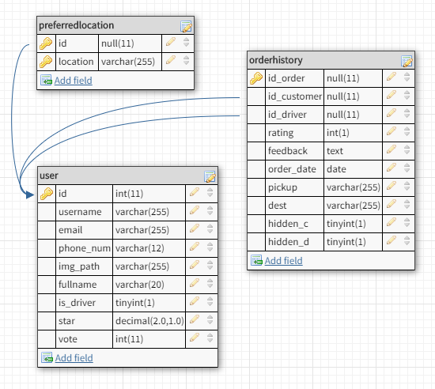
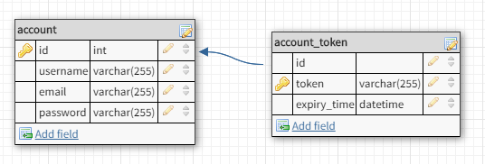

# Tugas 2 IF3110 Pengembangan Aplikasi Berbasis Web

Melakukan *upgrade* Website ojek online sederhana pada Tugas 1 dengan mengaplikasikan **arsitektur web service REST dan SOAP**.

## Anggota Tim

Kelompok GaussianLord terdiri dari seorang **dewa matematika** dan dua orang **manusia biasa** secara berurutan yaitu: 
1. Dewita Sonya Tarabunga - 13515021
2. Albertus Djauhari - 13515054
3. Erick Wijaya - 13515057

### Arsitektur Umum Server

Tugas 2 ini terdiri dari berberapa komponen yang harus dibuat:
* `Web app`: digunakan untuk menangani HTTP request dari web browser dan menghasilkan HTTP response. Bagian yang diimplementasi dengan JSP ini juga bertugas untuk meng-generate tampilan web layaknya PHP. Bagian ini wajib dibuat dengan **Java + Java Server Pages**. Maka dari itu, konversi seluruh kode PHP pada tugas 1 menjadi kode JSP.
* `Ojek Online Web Service`: digunakan sebagai interface yang dipanggil oleh aplikasi melalui protokol SOAP. melakukan query ke database, operasi insert, dan operasi update untuk entitas User, History, dan Preferred Locations. Webservice ini akan dipanggil oleh aplikasi dengan menggunakan SOAP. Webservice ini wajib dibuat dengan **JAX-WS dengan protokol SOAP atau Webservice lain** yang basisnya menggunakan **SOAP dan Java**.
* `Identity service`: dipanggil oleh aplikasi untuk menerima email (sebagai username) dan password pengguna, dan menghasilkan *access token*. Identity Service juga dipanggil oleh *ojek online web service* untuk melakukan validasi terhadap *access token* yang sedang dipegang oleh *web app*. Service ini dibuat menggunakan REST. Namun, selain menghandle request secara REST biasa, Identity Service juga harus bisa **menerima SOAP request dan mengembalikan SOAP response** (contoh SOAP request dan response dapat dilihat pada [link berikut](https://www.tutorialspoint.com/soap/soap_examples.htm)). Identity service ini wajib dibuat dengan menggunakan **Java Servlet**.
* `Database`: pisahkan basis data yang telah Anda buat pada tugas 1 menjadi basis data khusus manajemen *account* (menyimpan username, password, dkk) dan basis data ojek online tanpa manajemen *account*. Basis data *account* digunakan secara khusus oleh Identity Service. **Ojek Online Web Service tidak boleh secara langsung mengakses basis data account untuk melakukan validasi token** (harus melalui Identity Service).

### Deskripsi Tugas

Kebutuhan fungsional dan non-fungsional tugas yang dibuat adalah sebagai berikut.

1. Halaman website yang memiliki tampilan serupa dengan tugas 1.
2. Ojek Online web service dengan fungsi-fungsi sesuai kebutuhan sistem dalam mengakses data (kecuali login, register, dan logout).
3. Identity service yang menangani manajemen *account* seperti login dan register, serta validasi access token.
4. Fitur validasi email dan username pada halaman register tidak perlu diimplementasikan dengan menggunakan AJAX.
5. Tidak perlu melakukan validasi javascript.
6. Tampilan pada tugas ini **tidak akan dinilai**. Sangat disarankan untuk menggunakan asset dan tampilan dari tugas sebelumnya. Boleh menggunakan CSS framework seperti Bootstrap atau javascript library seperti jQuery.
7. Tidak perlu memperhatikan aspek keamanan dan etika penyimpanan data.

### Skenario

#### Login
1. Pengguna mengakses halaman login, contoh: `/login.jsp` dan mengisi form.
2. JSP akan membuka HTTP request ke Identity Service, contoh `POST /login` dengan body data email dan password.
3. Identity service akan melakukan query ke DB untuk mengetahui apakah email dan password tersebut valid.
4. Identity service akan memberikan HTTP response `access token` dan `expiry time` jika email dan password ada di dalam DB, atau error jika tidak ditemukan data. Silakan definisikan `expiry time` yang menurut Anda sesuai.
5. Access token ini digunakan sebagai representasi state dari session pengguna dan harus dikirimkan ketika pengguna ingin melakukan semua aktivitas, kecuali login, register, dan logout. 
6. Access token dibangkitkan secara random. Silakan definisikan sendiri panjang tokennya.
7. Cara penyimpanan access token dibebaskan.
8. Silakan definisikan format request dan response sesuai kebutuhan anda. Anda dapat menggunakan JSON atau XML untuk REST.

#### Register
1. Pengguna mengakses halaman register, contoh: `/register.jsp` dan mengisi form.
2. JSP akan melakukan HTTP request ke Identity Service, contoh `POST /register` dengan body data yang dibutuhkan untuk registrasi.
3. Identity service akan query DB untuk melakukan validasi bahwa email dan username belum pernah terdaftar sebelumnya.
4. Identity service akan menambahkan user ke DB bila validasi berhasil, atau memberi HTTP response error jika username sudah ada atau confirm password salah.
5. Identity service akan memberikan HTTP response `access token` dan `expiry time` dan user akan ter-login ke halaman profile bila user merupakan driver atau ke halaman order bila user bukan merupakan driver.
6. Silakan definisikan format request dan response sesuai kebutuhan anda. Anda dapat menggunakan JSON atau XML untuk REST.

#### Logout
1. Pengguna menekan tombol logout.
2. JSP akan melakukan HTTP request ke Identity Service, contoh `POST /logout` dengan body data yang dibutuhkan.
3. Identity service akan menghapus atau melakukan invalidasi terhadap access token yang diberikan.
4. Identity service akan mengembalikan HTTP response berhasil.
5. Halaman di-*redirect* ke halaman login.

#### Add Preferred Location, Make an Order, dll
1. Pengguna mengakses halaman add preferred location, misal `/add-preferred-location.jsp` dan mengisi form.
2. JSP akan memanggil fungsi pada *ojek online web service* dengan SOAP, misalnya `addPreferredLocation(access_token, location)`. Contohnya, dapat dilihat pada
[link berikut](http://www.mkyong.com/webservices/jax-ws/jax-ws-hello-world-example/)
Perhatikan pemanggilan pada contoh ini seperti melakukan remote procedure call.
3. Fungsi tersebut akan melakukan HTTP request ke Identity Service, untuk mengenali user dengan `access_token` yang diberikan.
    - Jika `access_token` **kadaluarsa**, maka `addPreferredLocation` akan memberikan response expired token.
    - Jika `access_token` **tidak valid**, maka `addPreferredLocation` akan memberikan response error ke JSP.
    - Jika `access_token` **valid**, maka `addPreferredLocation` akan memasukan produk ke DB, dan memberikan response kesuksesan ke JSP.
4. Jika `access_token` sudah kadaluarsa atau tidak valid (yang diketahui dari response error ojek online web service), sistem akan me-redirect user ke halaman login.
5. Untuk make an order, get history, dan lainnya kira-kira memiliki mekanisme yang sama dengan add preferred locations di atas.
6. Silakan definisikan format object request dan response sesuai kebutuhan anda.

#### Bonus
Mekanisme *auto-renew* access token yang tepat sehingga user tidak ter-logout secara paksa saat melakukan serangkaian aktivitas pada sistem dalam waktu yang cukup lama. Access token dapat di generate kembali ketika lifetime dari token tersebut habis. Cara implementasi dibebaskan.

### Penjelasan
#### Basis Data

Pada tugas ini digunakan dua basis data, yaitu basis data **GaussianLord_main** yang menyimpan data ojek online secara umum dan **GaussianLord_acc** yang secara khusus menyimpan data akun dan token. Berikut adalah skema basis data:

**GaussianLord_main**

**GaussianLord_acc**

#### Konsep <i>shared session</i> dengan menggunakan REST

Pada arsitektur REST, server tidak menyimpan state dari session masing - masing client. Server hanya menyimpan data session
dari client yang mengakses, namun tidak menyimpan state dari client tersebut. Untuk mengetahui state client, state harus 
ditransfer oleh client menuju lokasi yang membutuhkan. Kondisi server yang stateless ini membuat server mampu memberikan
layanan kepada banyak pengguna yang menggunakan web secara konkuren. 

#### Token dan Expiry Time

Pada sistem yang kelompok kami buat, token dan expiry time dihasilkan saat pengguna berhasil login (melalui halaman login dan register). 
Token terdiri dari string alfabet sepanjang 20 karakter yang digenerate secara random. Setelah login, token dari pengguna
akan divalidasi setiap saat pengguna mengkases web dengan melakukan request dari WebService ke IdentityService. Jika token pengguna 
sudah tidak valid atau expired, pengguna akan langsung logout dan kembali ke halaman login.

#### Kelebihan arsitektur Web service REST dan SOAP dengan aplikasi monolitik

Salah satu kelebihan menggunakan arsitektur REST dan SOAP ketimbang aplikasi monolitik adalah implementasi dari setiap bagian program 
dapat dikerjakan secara terpisah oleh kontributor. Implementasi yang terpisah juga mempercepat proses debugging program karena error umumnya 
hanya menyebabkan failure pada modul itu saja. Selain itu, implementasi terpisah juga memperjelas pembagian kerja anggota dan mengurangi 
jumlah konflik yang mungkin terjadi. Selain itu kelebihan arsitektur ini juga adalah platform independent dan languange independent. 

#### Kekurangan arsitektur Web service REST dan SOAP dengan aplikasi monolitik

Karena dengan arsitektur ini implementasi program dilakukan secara terpisah, hal ini menyebabkan dibutuhkan waktu tambahan untuk melakukan 
integrasi dari setiap komponen-komponen. Selain itu ada bagian program yang membutuhkan program lain sehingga program tersebut harus didelay 
pengerjaannya hingga program yang dibutuhkan sudah dibuat. Contohnya WebApplication bergantung pada jax-ws sehingga tidak efektif untuk 
menulis kode jsp apabila WebService jax-ws belum selesai. 

### Pembagian Tugas

**REST :**
1. Generate token : 13515021
2. Validasi token : 13515021
3. Login : 13515057
4. Logout : 13515057
5. Register : 13515054

**SOAP :**
1. Service Location : 13515021
2. Token Validator : 13515057
3. Service User : 13515054
4. Service Order : 13515021

**Web app (JSP) :**
1. Tampilan Login (jsp) : 13515057
2. Fungsionalitas Login (java) : 13515057
3. Tampilan Logout (jsp) : 13515054
4. Fungsionalitas Logout (java) : 13515054
5. Tampilan Register : 13515054
6. Fungsionalitas Register : 13515054
7. Tampilan Order : 13515021
8. Fungsionalotas Order : 13515021
9. Tampilan History : 13515057
10. Fungsionalitas History : 13515021
11. Tampilan Profile : 13515021
12. Fungsionalitas Profile : 13515021
13. Navigation Bar : 13515057

## About

GaussianLord

Dewita | Bertus | Erick

Dosen : Yudistira Dwi Wardhana | Riza Satria Perdana | Muhammad Zuhri Catur Candra