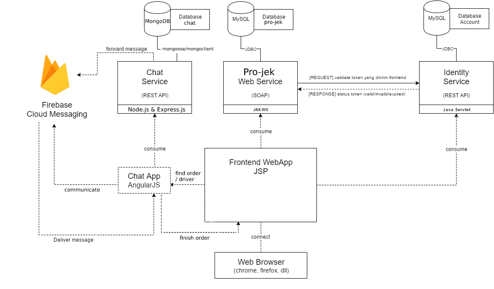
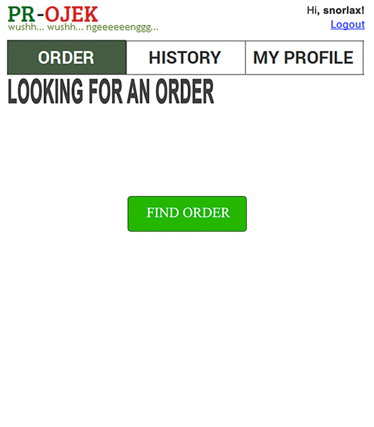
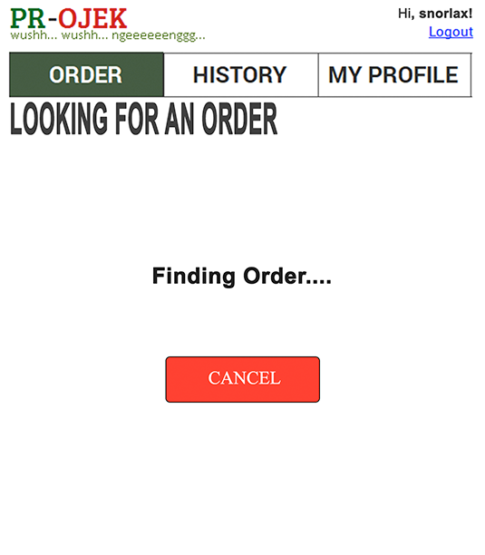
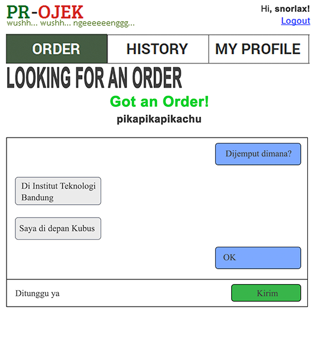
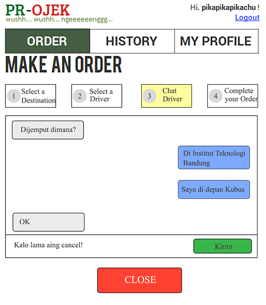

# Tugas 3 IF3110 Pengembangan Aplikasi Berbasis Web
Melakukan upgrade Website ojek online sederhana pada Tugas 2 dengan mengaplikasikan ***cloud service* (Firebase Cloud Messaging) dan *framework* MEAN stack**.

## Tujuan Pembuatan Tugas

Tugas ini memiliki tujuan untuk memahami:
* MEAN stack (Mongo, Express, Angular, dan Node)
* *Cloud service* Firebase Cloud Messaging (FCM) dan kegunaannya.
* Web security terkait access token dan HTTP Headers.

## Anggota Tim
* [Edwin Kumara T - 13515039](https://github.com/echo-delta)
* [Alvin Sullivan - 13515048](https://github.com/Sulley01)
* [Erick Wijaya - 13515057](https://github.com/wijayaerick)

### Arsitektur Umum

Tugas 3 ini terdiri dari komponen Tugas 2 dan tambahan yang harus dibuat:
* `Pemanfaatan FCM`: Pengiriman pesan dari pelanggan ke driver atau sebaliknya dengan menggunakan layanan Firebase Cloud Messaging (FCM).
* `Implementasi MEAN stack`: Membuat REST service untuk keperluan layanan chat memanfaatkan FCM menggunakan Node, Express dan Mongo, serta membuat halaman chat yang menggunakan Angular.

### Deskripsi Tugas
Kali ini, Anda diminta untuk merubah sedikit fungsionalitas order yang sudah ada dan menambah fungsionalitas chat pada aplikasi yang telah anda buat pada tugas 2. Aplikasi ini akan menggunakan MEAN stack untuk halaman chat dan REST service, serta menggunakan layanan cloud Firebase Cloud Messaging sebagai media penyampaian pesan. Selain itu, Anda juga diminta untuk mengimplementasikan beberapa fitur security. Spesifikasi untuk tugas ini adalah sebagai berikut:

1. Halaman Order akan bergantung pada status pengguna, apakah driver atau bukan.
2. Bila status pengguna merupakan driver maka pada halaman order akan ditampilkan fitur finding order dimana akan membuat driver visible ketika user ingin melakukan order pada halaman select driver. Apabila driver tidak melakukan finding order, maka driver tidak akan ditampilkan pada halaman select driver ketika pengguna non driver melakukan order.
3. Pengguna dapat saling bertukar pesan dengan driver secara realtime di halaman order chat driver. Fitur ini harus diimplementasikan dengan MEAN stack, di mana fitur halmaman chat harus diimplementasikan dengan Angular dan fitur REST service diimplementasikan menggunakan Node, Express, dan Mongo.
4. REST service yang akan menghubungkan client dan Firebase Cloud Messaging. Rincian service ini akan dijelaskan kemudian. Silahkan pelajari cara mendaftar ke layanan Firebase, dan cara membuat project baru.
5. Pengguna harus login terlebih dahulu sebelum dapat melakukan chat. Silahkan cari cara untuk sharing session antara JSP dan MEAN. Sebagai contoh, anda dapat menggunakan cookie yang dapat diakses oleh keduanya.
6. Pada halaman order select driver, aplikasi hanya menampilkan driver yang **sesuai requirement** saja (lihat poin 7). Ketika nama driver dipilih, maka akan muncul kotak chat antar pengguna non driver dan driver pada tab chat driver di halaman order.
7. Requirement yang dimaksud ialah driver memiliki preferred location yang dituju pengguna, online, **sedang melakukan finding order**, dan tidak sedang mendapat order.
8. Pengguna dengan IP address yang berbeda tidak dapat menggunakan access token yang sama.
9. Pengguna dengan user-agent yang berbeda tidak dapat menggunakan access token yang sama. Dalam hal ini, user-agent yang dimaksud adalah web browser yang digunakan.
10. Komponen yang harus digunakan pada AngularJS adalah:
    * Data binding (ng-model directives)
    * Controllers (ng-controllers)
    * ng-repeat, untuk menampilkan list
    * $http untuk AJAX request
    * $scope untuk komunikasi data antara controller dengan view.
11. Tidak perlu memperhatikan aspek keamanan dan etika dalam penyimpanan data.

### Rincian REST Service
1. REST service untuk keperluan chatting **wajib** diimplementasikan dengan **Node dan Express**.
2. REST service menangani hal-hal sebagai berikut.
    * Memberikan daftar driver yang sesuai requirement (sesuai deskripsi tugas nomor 7)
    * Menyimpan identitas (token FCM) dari masing-masing pengguna yang sedang online
    * Menerima *request* dari user A untuk chat ke user B, lalu membuat *request* ke FCM untuk pengiriman pesan ke token FCM user B.
    * Menyimpan ke basis data history chat dari seorang pemesan dan seorang driver. Misalkan A pernah memesan driver B. Jika suatu saat A akan memesan lagi ke driver B, maka kotak chat menampilkan chat yang dilakukan pada pemesanan sebelumnya.
3. Untuk penyimpanan history chat, basis data yang digunakan **wajib Mongo**. Anda tidak diperkenankan menggunakan basis data yang lain, termasuk layanan Firebase Database.

### Halaman Tambahan
1. Halaman Order pada pengguna non driver, terdapat tambahan chat driver pada tahap ketiga
2. Halaman Order pada pengguna driver

### Rincian Arsitektur Aplikasi Chat

Proses untuk komunikasi antar client adalah sebagai berikut:
1. Ketika client dijalankan, client akan meminta token (token yang berbeda dengan token untuk authentication dari Identity Service) dari FCM.
2. FCM mengirimkan token ke client.
3. Setelah token diterima, client akan mengirim token serta identitas dari client (nama/email) ke chat server. Identitas client digunakan untuk mengidentifikasi kepemilikan token.
4. Untuk mengirim pesan kepada client lain, client pertama mengirimkan pesan yang berisi identitas pengirim, identitas tujuan, dan isi pesan ke chat server.
5. Chat server kemudian akan mencari token yang terkait dengan identitas tujuan.
6. Chat server lalu mengirim request ke FCM untuk mengirimkan pesan kepada client dangan token yang terkait.
7. FCM mengirimkan pesan kepada tujuan.

### Asumsi yang Digunakan
1. Pada tugas ini, diasumsikan kedua client sedang aktif. Aplikasi hanya akan dijalankan pada localhost, sehingga memerlukan 2 browser yang berbeda untuk mensimulasikan client yang berbeda. Aplikasi berjalan pada localhost karena browser mensyaratkan sumber aplikasi harus aman untuk operasi-operasi yang digunakan pada aplikasi ini. Localhost termasuk lokasi yang diperbolehkan oleh browser.
2. Kedua browser tersebut harus dalam keadaan aktif dan terfokus, serta tidak terminimize. Hal ini karena cara kerja service worker, yang hanya dapat memberikan notifikasi, dan tidak dapat melakukan manipulasi halaman apabila web browser tidak sedang terfokus ketika pesan datang.
Selain itu, seorang pengguna hanya dapat chatting dengan 1 pengguna lain dalam 1 waktu, sehingga hanya 1 kotak chat yang ditampilkan.
3. Driver hanya dapat menerima satu order dari satu user pada satu waktu.

### Skenario Chatting
Skenario penggunaan aplikasi adalah sebagai berikut.
Misal pengguna A adalah non driver, dan pengguna B adalah driver.
1. A dan B login untuk masuk ke aplikasi.
2. B melakukan finding order pada halaman Order. A memasuki halaman Order.
3. A melakukan order dan memilih driver yang sedang online dan tersedia (driver B).
4. Kotak chat akan muncul di halaman Chat Driver pada layar A. Kotak chat juga akan muncul pada halaman Order pada B.
5. A mengetikkan pesan, dan menekan tombol kirim.
6. Pesan dikirim ke B melalui chat server dan FCM.
7. Ketika pesan sudah diterima di B, kotak chat pada layar B akan muncul.
8. B dapat membalas chat dari A.
9. Apabila A sudah melakukan submit rating maka chatbox pada B akan hilang dan kembali menampilkan halaman finding order.

### Skenario Umum Program
Skenario program selain chat, pada umumnya sama seperti tugas 2. Akan tetapi, metode pengecekan token pada identity service sedikit berbeda.

Identity Service harus mengecek:
1. Apakah access token ini sudah kadaluarsa?
2. Apakah access token ini digunakan pada browser yang berbeda?
3. Apakah access token ini digunakan dengan koneksi internet yang berbeda?

Jika jawaban salah satu pertanyaan tersebut adalah "ya", maka identity service akan memberikan respon error dan detail errornya.

### Mekanisme pembuatan token
Token anda harus mempunyai informasi terkait browser (user agent) dan IP address dari pengguna. Identity service harus dapat mengekstrak informasi tersebut. Sebagai contoh, anda dapat melakukan (tidak harus) konstruksi token dengan `format:some_random_string#user_agent#ip_address`. Jika pada tugas 2 token anda adalah abcdefgh Maka pada tugas 3 token anda adalah `abcdefgh#Mozilla/5.0 (Windows NT 6.3; WOW64) AppleWebKit/537.36 (KHTML, like Gecko) Chrome/46.0.2490.86 Safari/537.36#167.205.22.104`.

Token tidak perlu dienkripsi-dekripsi (for simplicity)

### Tampilan Program
Halaman Order pada Driver

Halaman Order pada Driver Ketika Melakukan Finding Order

Halaman Order pada Driver Ketika Mendapat Order

Halaman Order pada Pengguna, Chat Driver

Perlu diperhatikan bahwa chat yang dikirim oleh user yang sedang login berada disisi sebelah kanan dan lawan chatnya lain di sisi sebelah kirim. Isi chat jga harus ditampilkan sesuai urutan waktu diterima (paling atas adalah chat paling lama dan makin ke bawah chat makin baru).

### Referensi Terkait
Berikut adalah referensi terkait tugas ini:
1. https://firebase.google.com/docs/web/setup
2. https://firebase.google.com/docs/cloud-messaging/js/client
3. https://docs.angularjs.org/api

### Pembagian Tugas
**Chat App Front-end :**
1. Find Order : 13515057
2. User Chat : 13515048
3. Driver Chat : 13515039

**Chat REST Service :**
1. MongoDB Model : 13515048
2. Get/Post Message : 13515039
3. Get/Post Finding : 13515039
4. Firebase Messaging : 13515057
5. Firebase Token : 13515057

**Fitur security (IP, User-agent) :**
1. Generate Token : 13515048
2. Validate Token : 13515057
3. Get Validation Status : 13515039
4. Login/Register Token Process : 13515048

## About
Kelompok SWT

[Edwin](https://github.com/echo-delta) | [Alvin](https://github.com/Sulley01) | [Erick](https://github.com/wijayaerick)

Dosen : Yudistira Dwi Wardhana | Riza Satria Perdana | Muhammad Zuhri Catur Candra
